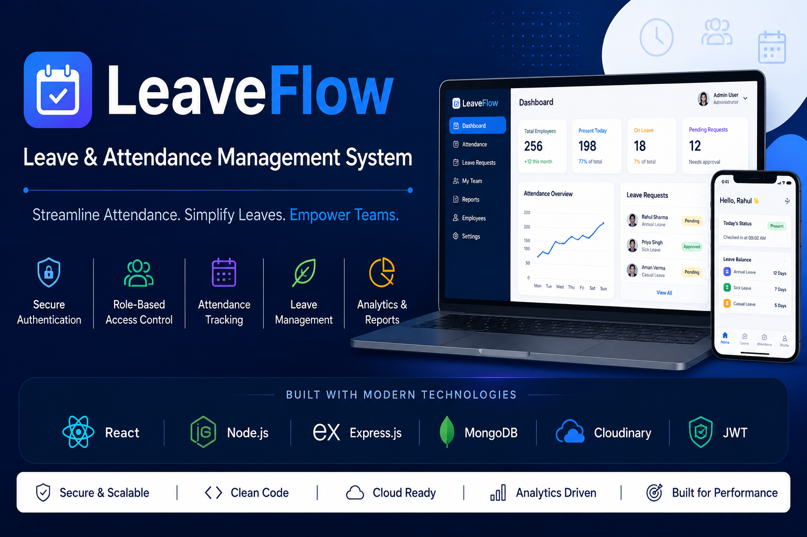
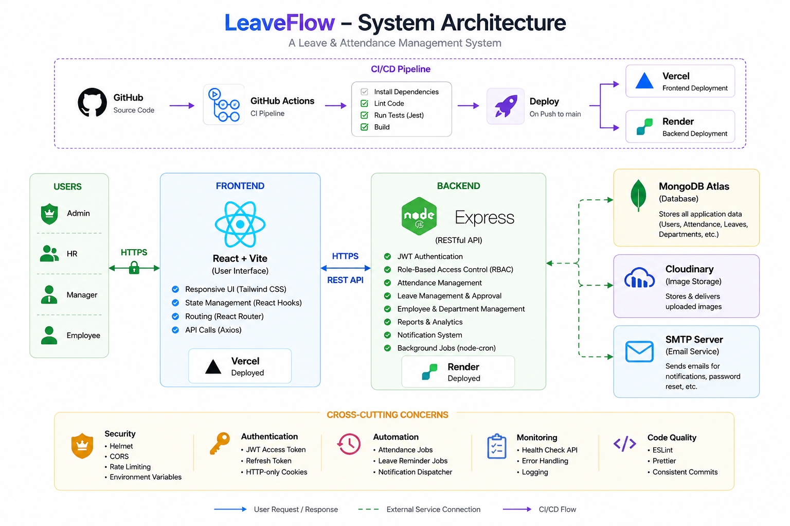

<p align="center">
  
</p>

<h1 align="center">🚀 LeaveFlow</h1>

<p align="center">
  A Production-Ready Leave & Attendance Management System built with the MERN Stack.
</p>

<p align="center">
  Secure JWT Authentication • RBAC • Attendance • Leave Management • Cloud Deployment
</p>

<p align="center">


</p>

<p align="center">


</p>

## 📑 Table of Contents

- [🌐 Live Demo](#-live-demo)
- [📖 About](#-about)
- [✨ Features](#-features)
- [🛠 Tech Stack](#-tech-stack)
- [🏗️ System Architecture](#️-system-architecture)
- [📂 Project Structure](#-project-structure)
- [🚀 Getting Started](#-getting-started)
- [🔑 Environment Variables](#-environment-variables)
- [📖 API Documentation](#-api-documentation)
- [🧪 Testing](#-testing)
- [🚀 Deployment](#-deployment)
- [📸 Application Preview](#-application-preview)
- [🚀 Future Roadmap](#-future-roadmap)
- [🤝 Contributing](#-contributing)
- [📜 License](#-license)
- [🙏 Acknowledgements](#-acknowledgements)

## 🌐 Live Demo

> ⚠️ **Note:** The backend is hosted on **Render's free tier**. If the application has been inactive, the first request may take **30–60 seconds** while the server wakes up.

| Service              | Link                                                              |
| -------------------- | ----------------------------------------------------------------- |
| 🚀 Live Application  | https://leave-attendance-management-system.vercel.app             |
| 📖 Swagger API Docs  | https://leave-attendance-management-system.onrender.com/api/docs  |
| ⚙️ Backend API       | https://leave-attendance-management-system.onrender.com           |
| 📂 GitHub Repository | https://github.com/Krishna2621/leave-attendance-management-system |

---

## 📖 About

LeaveFlow is a full-stack enterprise Leave & Attendance Management System developed as an internship project. It streamlines attendance tracking, leave applications, employee management, department management, and administrative operations through a secure role-based architecture.

The application follows modern software engineering practices, including authentication using JWT, secure HTTP-only cookies, automated CI with GitHub Actions, cloud deployment, and a modular MERN architecture.

## 💡 Why LeaveFlow?

Many small and medium-sized organizations still rely on spreadsheets, emails, or manual processes to manage attendance and leave requests. LeaveFlow was built to provide a centralized, secure, and scalable solution that simplifies these workflows.

The application enables employees to manage attendance and leave requests efficiently while giving managers, HR personnel, and administrators role-specific dashboards and controls. The project also demonstrates modern full-stack development practices, including secure authentication, RESTful API design, cloud deployment, and production-ready architecture.

## 🌟 Project Highlights

- 🔐 Secure authentication with **JWT Access Tokens** and **Refresh Token Rotation**
- 🛡️ Role-Based Access Control (RBAC) for Employee, Manager, HR, and Admin
- 📅 Attendance tracking with leave management and approval workflows
- 📊 Interactive dashboards with role-specific analytics
- ☁️ Cloud deployment using **Vercel** (Frontend) and **Render** (Backend)
- 📖 REST API documented with **Swagger (OpenAPI)**
- 🐳 Docker support for containerized development
- ⚙️ Automated workflows with **GitHub Actions**
- ✉️ Email notifications and password reset functionality
- 🧪 Code quality maintained with **ESLint**, **Prettier**, and **Jest**

## 📈 Key Metrics

| Metric               |                            Value |
| -------------------- | -------------------------------: |
| 🏗 Architecture       |                       MERN Stack |
| 👥 Supported Roles   | 4 (Employee, Manager, HR, Admin) |
| 🔐 Authentication    |             JWT + Refresh Tokens |
| 🛡 Authorization      | Role-Based Access Control (RBAC) |
| 📚 API Documentation |                Swagger (OpenAPI) |
| ☁️ Deployment        |                  Vercel + Render |
| 💾 Database          |                    MongoDB Atlas |
| ⚙️ Background Jobs   |            Cron-based Automation |

## 🗓️ Development Journey

LeaveFlow was developed incrementally following modern software engineering practices. Each phase focused on building, testing, and validating a core part of the system before moving to the next.

| Phase                                 |    Status    |
| ------------------------------------- | :----------: |
| 🏗️ Backend Foundation                 | ✅ Completed |
| 🔐 Authentication & Authorization     | ✅ Completed |
| 👥 Employee & Department Management   | ✅ Completed |
| 📅 Attendance Management              | ✅ Completed |
| 🌴 Leave Management                   | ✅ Completed |
| 📊 Dashboard & Reporting              | ✅ Completed |
| 📧 Notifications & Email Services     | ✅ Completed |
| ⚙️ Background Automation (Cron Jobs)  | ✅ Completed |
| 📖 Swagger API Documentation          | ✅ Completed |
| ☁️ Cloud Deployment (Render + Vercel) | ✅ Completed |
| 🚀 Production Release                 | ✅ Completed |

## ✨ Features

### 🔐 Authentication & Authorization

- JWT-based Authentication
- Refresh Token Sessions
- Secure HTTP-only Cookies
- Password Hashing with bcrypt
- Role-Based Access Control (RBAC)
- Protected API Routes

### 👥 Employee & Department Management

- Employee Management
- Department Management
- Manager Assignment
- User Profile Management

### 📅 Attendance Management

- Mark Daily Attendance
- Attendance Dashboard
- Attendance Calendar
- Attendance History
- Attendance Reports

### 🌴 Leave Management

- Apply for Leave
- Leave Approval Workflow
- Leave Balance Tracking
- Leave Status Management
- Automatic Leave Balance Initialization

### 📊 Reporting & Analytics

- Attendance Reports
- Leave Reports
- Dashboard Analytics
- Department-wise Statistics

### ⚙️ Automation

- Attendance Automation Jobs
- Leave Reminder Jobs
- Notification Dispatcher
- Scheduled Background Tasks (Cron Jobs)

### 📧 Notifications

- Email Notifications
- Password Reset Emails
- Automated Email Templates

### 🛠 Developer Experience

- RESTful API
- Swagger API Documentation
- Docker & Docker Compose
- GitHub Actions CI
- ESLint
- Prettier
- Jest Unit Testing
- Cloud Deployment (Render & Vercel)

- ## 🛠 Tech Stack

| Category              | Technologies                                          |
| --------------------- | ----------------------------------------------------- |
| **Frontend**          | React 19, Vite, React Router DOM, Axios, Tailwind CSS |
| **Backend**           | Node.js, Express.js                                   |
| **Database**          | MongoDB Atlas, Mongoose                               |
| **Authentication**    | JSON Web Token (JWT), Refresh Tokens, bcrypt          |
| **Authorization**     | Role-Based Access Control (RBAC)                      |
| **API Documentation** | Swagger (OpenAPI)                                     |
| **Cloud Storage**     | Cloudinary                                            |
| **Email Service**     | Nodemailer (SMTP)                                     |
| **Automation**        | node-cron                                             |
| **Testing**           | Jest                                                  |
| **Code Quality**      | ESLint, Prettier                                      |
| **DevOps & CI/CD**    | Docker, Docker Compose, GitHub Actions                |
| **Deployment**        | Vercel (Frontend), Render (Backend)                   |
| **Version Control**   | Git, GitHub                                           |

## 🏗️ System Architecture

<p align="center">
  
</p>

### 📖 Architecture Overview

LeaveFlow follows a modern client-server architecture built on the MERN stack.

- **Frontend:** React + Vite deployed on **Vercel**
- **Backend:** Express.js REST API deployed on **Render**
- **Database:** MongoDB Atlas
- **Authentication:** JWT + Refresh Tokens using HTTP-only cookies
- **Cloud Storage:** Cloudinary
- **Email Service:** SMTP (Nodemailer)
- **Automation:** Background Cron Jobs
- **CI/CD:** GitHub Actions

  ### 🌍 Production Deployment Flow

```text
                User
                  │
                  ▼
      Vercel (React + Vite)
                  │
                  ▼
        /api (Vercel Rewrite)
                  │
                  ▼
     Render (Express.js Backend)
                  │
      ┌───────────┴───────────┐
      ▼                       ▼
 MongoDB Atlas          Cloudinary
      │
      ▼
 Scheduled Jobs (Cron)
      │
      ▼
 Email Service (SMTP)
```

- ## 📂 Project Structure

```
leave-attendance-management-system/
│
├── backend/                  # Express.js Backend
│   ├── config/               # Database & application configuration
│   ├── controllers/          # Business logic
│   ├── middleware/           # Authentication & validation
│   ├── models/               # Mongoose models
│   ├── routes/               # REST API routes
│   ├── services/             # Email & automation services
│   ├── templates/            # Email templates
│   ├── utils/                # Helper utilities
│   ├── tests/                # Jest test cases
│   └── server.js             # Entry point
│
├── frontend/                 # React + Vite Frontend
│   ├── src/
│   │   ├── api/
│   │   ├── components/
│   │   ├── context/
│   │   ├── hooks/
│   │   ├── layouts/
│   │   ├── pages/
│   │   ├── routes/
│   │   ├── styles/
│   │   └── utils/
│   └── public/
│
├── docs/                     # Documentation & diagrams
├── .github/                  # GitHub Actions workflows
├── docker-compose.yml        # Docker Compose configuration
├── README.md                 # Project documentation
└── LICENSE                   # MIT License
```

## 🚀 Getting Started

### Prerequisites

Make sure you have the following installed:

- Node.js (v22 or later)
- npm
- MongoDB Atlas account
- Cloudinary account
- Git
- Docker Desktop (Optional)

---

### 1️⃣ Clone the Repository

```bash
git clone https://github.com/Krishna2621/leave-attendance-management-system.git
```

```bash
cd leave-attendance-management-system
```

---

### 2️⃣ Install Dependencies

Backend

```bash
cd backend
npm install
```

Frontend

```bash
cd frontend
npm install
```

---

### 3️⃣ Configure Environment Variables

Create a `.env` file inside the **backend** directory.

You can use the provided `.env.example` as a template.

```bash
cp .env.example .env
```

Fill in the required values before starting the application.

---

### 4️⃣ Start the Backend

```bash
cd backend
npm run dev
```

---

### 5️⃣ Start the Frontend

```bash
cd frontend
npm run dev
```

---

### 6️⃣ Open the Application

Frontend

```
http://localhost:5173
```

Backend API

```
http://localhost:5000
```

Swagger Documentation

```
http://localhost:5000/api/docs
```

## 🔑 Environment Variables

Create a `.env` file inside the **backend** directory.

| Variable              | Description                     |
| --------------------- | ------------------------------- |
| PORT                  | Backend server port             |
| NODE_ENV              | Application environment         |
| MONGO_URI             | MongoDB Atlas connection string |
| JWT_SECRET            | JWT signing secret              |
| JWT_REFRESH_SECRET    | JWT refresh signing secret      |
| FRONTEND_URL          | Frontend application URL        |
| CLOUDINARY_CLOUD_NAME | Cloudinary cloud name           |
| CLOUDINARY_API_KEY    | Cloudinary API key              |
| CLOUDINARY_API_SECRET | Cloudinary API secret           |
| SMTP_HOST             | SMTP server host                |
| SMTP_PORT             | SMTP server port                |
| SMTP_USER             | SMTP username                   |
| SMTP_PASS             | SMTP password                   |

## 📖 API Documentation

LeaveFlow exposes a RESTful API for authentication, attendance management, leave management, employee management, reporting, and administration.

Interactive API documentation is available through Swagger UI.

### Swagger Documentation

**Local**

```text
http://localhost:5000/api/docs
```

**Production**

```text
https://leave-attendance-management-system.onrender.com/api/docs
```

### API Modules

| Module         | Description                                     |
| -------------- | ----------------------------------------------- |
| Authentication | User registration, login, logout, refresh token |
| Users          | User profile & employee management              |
| Attendance     | Attendance marking, calendar, history           |
| Leave          | Leave application & approval workflow           |
| Departments    | Department management                           |
| Dashboard      | Dashboard analytics                             |
| Reports        | Attendance & leave reports                      |
| Notifications  | Notification management                         |
| Automation     | Scheduled background jobs                       |

## 🧪 Testing

### Run Unit Tests

```bash
cd backend
npm test
```

### Run ESLint

Backend

```bash
cd backend
npm run lint
```

Frontend

```bash
cd frontend
npm run lint
```

### Check Code Formatting

```bash
npm run format:check
```

### Format the Project

```bash
npm run format
```

## 🚀 Deployment

The application is deployed using modern cloud platforms.

| Service       | Platform       |
| ------------- | -------------- |
| Frontend      | Vercel         |
| Backend       | Render         |
| Database      | MongoDB Atlas  |
| Image Storage | Cloudinary     |
| CI/CD         | GitHub Actions |

### Live Application

Frontend

https://leave-attendance-management-system.vercel.app

Backend

https://leave-attendance-management-system.onrender.com

## 🛠 Technical Challenges & Solutions

Throughout the development and deployment of LeaveFlow, several real-world engineering challenges were encountered and resolved.

| Challenge                                             | Solution                                                                                                               |
| ----------------------------------------------------- | ---------------------------------------------------------------------------------------------------------------------- |
| Cross-origin authentication between Vercel and Render | Configured secure HTTP-only cookies and routed API requests through Vercel rewrites to ensure reliable authentication. |
| React Router refresh causing 404 errors               | Added Vercel SPA rewrite rules so client-side routes resolve correctly after page refreshes.                           |
| Secure session management                             | Implemented JWT access tokens with refresh token rotation using HTTP-only cookies.                                     |
| Role-based authorization                              | Designed middleware to protect routes for Employee, Manager, HR, and Admin roles.                                      |
| API documentation                                     | Integrated Swagger (OpenAPI) for interactive API exploration and testing.                                              |
| Background automation                                 | Implemented scheduled cron jobs for notifications and automated tasks.                                                 |
| Production deployment                                 | Deployed the frontend on Vercel and backend on Render with environment-based configuration.                            |

## 🔒 Security Features

LeaveFlow is designed with security best practices to protect user accounts and sensitive data.

| Feature                            | Description                                          |
| ---------------------------------- | ---------------------------------------------------- |
| 🔑 JWT Authentication              | Secure access token authentication                   |
| 🔄 Refresh Token Rotation          | Automatically refreshes expired access tokens        |
| 🍪 HTTP-only Cookies               | Prevents JavaScript access to authentication cookies |
| 🔐 Password Hashing                | Passwords are securely hashed using bcrypt           |
| 🛡 Role-Based Access Control (RBAC) | Restricts access based on user roles                 |
| 🚦 Rate Limiting                   | Prevents brute-force and excessive API requests      |
| 🪖 Helmet                          | Adds secure HTTP headers                             |
| ✅ Request Validation              | Validates incoming requests using express-validator  |
| 🔒 Protected Routes                | Prevents unauthorized access to sensitive endpoints  |
| 🌐 CORS Protection                 | Restricts requests to trusted frontend origins       |

## 📸 Application Preview

### 🔐 Login


### 📊 Dashboard


### 📅 Attendance Management


### 🌴 Leave Management


### 📈 Reports Dashboard


## 🚀 Future Roadmap

- [x] JWT Authentication
- [x] Role-Based Access Control (RBAC)
- [x] Attendance Management
- [x] Leave Management
- [x] Department Management
- [x] Employee Management
- [x] Reporting Dashboard
- [x] Docker Support
- [x] GitHub Actions CI/CD
- [x] Cloud Deployment

### Planned Improvements

- [ ] AI-powered Leave Assistant
- [ ] AI Attendance Analytics
- [ ] Mobile Responsive UI Enhancements
- [ ] Dark Mode
- [ ] Push Notifications
- [ ] Two-Factor Authentication (2FA)
- [ ] Audit Dashboard
- [ ] Advanced Analytics
- [ ] Multi-Organization Support

## 🤝 Contributing

Contributions, feature requests, and suggestions are welcome.

If you would like to contribute:

1. Fork the repository.
2. Create a feature branch.
3. Commit your changes.
4. Push your branch.
5. Open a Pull Request.

## 📜 License

This project is licensed under the MIT License.

See the LICENSE file for more details.

## 🙏 Acknowledgements

Special thanks to:

- React
- Express.js
- MongoDB Atlas
- Vercel
- Render
- Cloudinary
- GitHub Actions
- Open Source Community
